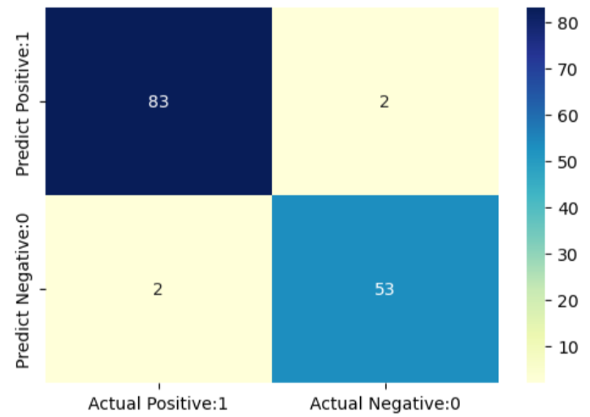
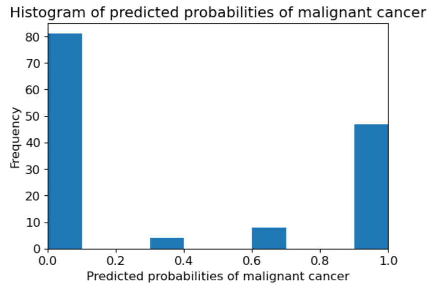
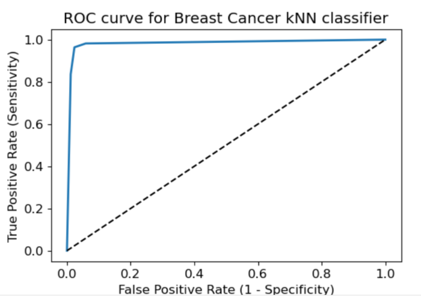

# Breast Cancer Classification using K-Nearest Neighbors (KNN)

This project leverages the Breast Cancer Wisconsin (Original) dataset to build a machine learning model that classifies tumors as **benign** or **malignant** using the **K-Nearest Neighbors (KNN)** algorithm. The pipeline includes data cleaning, feature scaling, correlation analysis, model training, and visual evaluation through various plots and performance metrics.

---

## Dataset Overview

The dataset includes 11 columns:

`['Id', 'Clump_thickness', 'Uniformity_Cell_Size', 'Uniformity_Cell_Shape', 'Marginal_Adhesion', 'Single_Epithelial_Cell_Size', 'Bare_Nuclei', 'Bland_Chromatin', 'Normal_Nucleoli', 'Mitoses', 'Class']`

- **Target column:** `Class`
  - `2` = Benign
  - `4` = Malignant

---

## Data Preprocessing

- Dropped the `Id` column as it had no predictive value.
- Cleaned non-numeric values in the `Bare_Nuclei` column.
- Scaled all features using `StandardScaler` for normalization.
- Generated a correlation heatmap to identify feature relationships.

---

## Model: K-Nearest Neighbors (KNN)

- Implemented KNN for classification due to its effectiveness in pattern recognition tasks.
- The dataset was split into training and testing subsets.
- Model evaluation included accuracy scoring and confusion matrix analysis.

### Model Performance

- **Training Accuracy:** 0.9821
- **Testing Accuracy:** 0.9786

### Confusion Matrix

---

## Exploratory Data Analysis

- Distribution analysis of `Class` variable
- Feature correlation visualization
- Histograms for feature distributions  
> *Histogram Example:*  
> 

- ROC Curve plotted for classifier performance  
> *ROC Curve:*  
> 

---

## Tech Stack

- **Language:** Python (Jupyter Notebook)
- **Libraries:** Pandas, NumPy, Matplotlib, Seaborn, Scikit-learn

---

## Author

Built by **Mariyam Chauhdry** - AI Engineer

Feel Free to connect on [LinkedIn](https://www.linkedin.com/in/mariyam-chauhdry-592231270)

